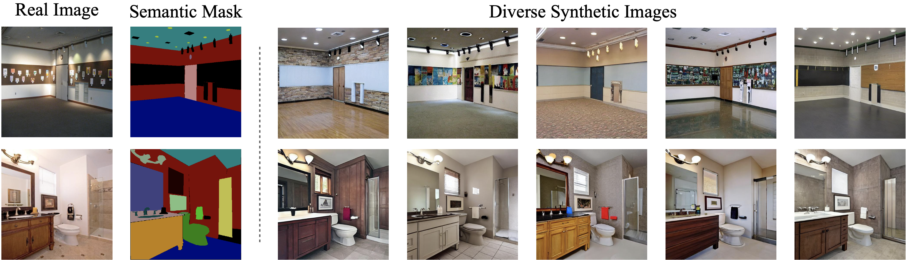
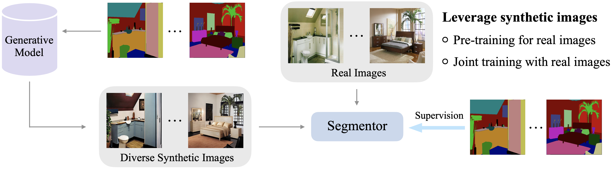

# FreeMask

This codebase provides the official PyTorch implementation of our NeurIPS 2023 paper:

> **[FreeMask: Synthetic Images with Dense Annotations Make Stronger Segmentation Models]()**</br>
> Lihe Yang, Xiaogang Xu, Bingyi Kang, Yinghuan Shi, Hengshuang Zhao</br>
> *In Conference on Neural Information Processing Systems (NeurIPS), 2023*</br>
> [[`Paper`](https://arxiv.org/abs/2310.15160)] [[`Datasets`](https://connecthkuhk-my.sharepoint.com/:f:/g/personal/liheyang_connect_hku_hk/ElmCo8xcr1tIk8XS0RK5UHwBJGxM7eEQPiP0LQbCJ3rlAA?e=TgEcUc)] [[`Models`](https://connecthkuhk-my.sharepoint.com/:f:/g/personal/liheyang_connect_hku_hk/EpTP2pjpiD1Np3dgdSxDrQIBqWc4x_95KA-7VVUa34iPJg?e=4Vv5uZ)] [[`Logs`](./training-logs)] [[`BibTeX`](#citation)]

## TL;DR

We generate diverse synthetic images from semantic masks, and use these synthetic pairs to boost the *fully-supervised* semantic segmentation performance.
<p align="left">

</p>

---

<p align="left">

</p>


## Results

### ADE20K

|     Model   |  Backbone |  Real Images  |  + Synthetic Images |  Gain ($\Delta$)  |  Download  |
|:-----------:|:---------:|:-------:|:-----------:|:----------:|:----------:|
| Mask2Former |   Swin-T  |  48.7  |     52.0     |  **+3.3**  | [ckpt](https://connecthkuhk-my.sharepoint.com/:u:/g/personal/liheyang_connect_hku_hk/EcUp1OL0FVNEp-xVZLSzYHIB5LG4d7fqWpNClb66pWeFXQ?e=c1sJaA) \| [log](./training-logs/ade20k_mask2former_swin-t_mIoU-52.0.log) |
| Mask2Former |   Swin-S  |  51.6  |     53.3     |  **+1.7**  | [ckpt](https://connecthkuhk-my.sharepoint.com/:u:/g/personal/liheyang_connect_hku_hk/EZZfCOuGkABHk4n--wNB5tIBhFEsEl_-G9GqCf4IdpINSg?e=u6Yi7l) \| [log](./training-logs/ade20k_mask2former_swin-s_mIoU-53.3.log) |
| Mask2Former |   Swin-B  |  52.4  |     53.7     |  **+1.3**  | [ckpt](https://connecthkuhk-my.sharepoint.com/:u:/g/personal/liheyang_connect_hku_hk/Ecg-Dq34SiBFms2SfXY8GQABhnhXmvsQ6xT2jC0Jvau2nw?e=CGG9IY) \| [log](./training-logs/ade20k_mask2former_swin-b_mIoU-53.7.log) |
| SegFormer   |   MiT-B2  |  45.6  |     47.9     |  **+2.3**  | [ckpt](https://connecthkuhk-my.sharepoint.com/:u:/g/personal/liheyang_connect_hku_hk/EcPbfSNm5UNBlNqpQpSf5L0BA5ll-9kQ3IPfAsFeUB8uXg?e=b3kpqe) \| [log](./training-logs/ade20k_segformer_mit-b2_mIoU-47.9.log) |
| SegFormer   |   MiT-B4  |  48.5  |     50.6     |  **+2.1**  | [ckpt](https://connecthkuhk-my.sharepoint.com/:u:/g/personal/liheyang_connect_hku_hk/EWlhL6eFOA1KoEQ3x1OhwzIB7FFWM-M52OnxrLfJ0CIE2w?e=4eLoCA) \| [log](./training-logs/ade20k_segformer_mit-b4_mIoU-50.6.log) |
| Segmenter   |   ViT-S   |  46.2  |     47.9     |  **+1.7**  | [ckpt](https://connecthkuhk-my.sharepoint.com/:u:/g/personal/liheyang_connect_hku_hk/ETTAWgdEeOtPv_p3UImc0DUBPeK6TCdE1DaO5PvK400ncg?e=UiGUtm) \| [log](./training-logs/ade20k_segmenter_vit-s_mIoU-47.9.log) |
| Segmenter   |   ViT-B   |  49.6  |     51.1     |  **+1.5**  | [ckpt](https://connecthkuhk-my.sharepoint.com/:u:/g/personal/liheyang_connect_hku_hk/EaxESzST9lVAhpklQ2Bk550BOUxwgSFPlXMgcEOKgVK8Xg?e=jcOR1L) \| [log](./training-logs/ade20k_segmenter_vit-b_mIoU-51.1.log) |

### COCO-Stuff-164K

|     Model   |  Backbone |  Real Images |  + Synthetic Images  |  Gain ($\Delta$)  |  Download  |
|:-----------:|:---------:|:-------:|:-----------:|:----------:|:----------:|
| Mask2Former |   Swin-T  |  44.5  |     46.4     |  **+1.9**  | [ckpt](https://connecthkuhk-my.sharepoint.com/:u:/g/personal/liheyang_connect_hku_hk/EbWduyNYlq1KpdUFPUrFuncBn9aN2iVRIpCLAqjqZ2LpLw?e=KTtoon) \| [log](./training-logs/coco_mask2former_swin-t_mIoU-46.4.log) |
| Mask2Former |   Swin-S  |  46.8  |     47.6     |  **+0.8**  | [ckpt](https://connecthkuhk-my.sharepoint.com/:u:/g/personal/liheyang_connect_hku_hk/EWYgBhTQIalKsNAaoA9Zsi8BQa7979--5FvfJMcA4RLLVg?e=PPekxc) \| [log](./training-logs/coco_mask2former_swin-s_mIoU-47.6.log) |
| SegFormer   |   MiT-B2  |  43.5  |     44.2     |  **+0.7**  | [ckpt](https://connecthkuhk-my.sharepoint.com/:u:/g/personal/liheyang_connect_hku_hk/ERVPEcdsK_FMmHXn7Aa_sS0Bnyg442yHKD_1WeW-iTNDDQ?e=Cqlinl) \| [log](./training-logs/coco_segformer_mit-b2_mIoU-44.2.log) |
| SegFormer   |   MiT-B4  |  45.8  |     46.6     |  **+0.8**  | [ckpt](https://connecthkuhk-my.sharepoint.com/:u:/g/personal/liheyang_connect_hku_hk/EeTD9uVM3o1FpHIGhSjEJOgBNZRIAnyw-MpYoWp_vpzVDQ?e=LiG6EA) \| [log](./training-logs/coco_segformer_mit-b4_mIoU-46.6.log) |
| Segmenter   |   ViT-S   |  43.5  |     44.8     |  **+1.3**  | [ckpt](https://connecthkuhk-my.sharepoint.com/:u:/g/personal/liheyang_connect_hku_hk/ESO3ijf4rkZIqmA44Hc3e4oBhNhhSe6uDNaQIvBwH0c0rw?e=H6OfJB) \| [log](./training-logs/coco_segmenter_vit-s_mIoU-44.8.log) |
| Segmenter   |   ViT-B   |  46.0  |     47.5     |  **+1.5**  | [ckpt](https://connecthkuhk-my.sharepoint.com/:u:/g/personal/liheyang_connect_hku_hk/ERw3YLH7i-pBgiS8kWwfErABeW_Br7V7ahgiSwB9yMMu-g?e=fpks5I) \| [log](./training-logs/coco_segmenter_vit-b_mIoU-47.5.log) |

## Getting Started


### High-Quality Synthetic Datasets

We share our already processed synthetic ADE20K and COCO-Stuff-164K datasets below. The ADE20K-Synthetic dataset is **20x larger** than its real counterpart, while the COCO-Synthetic is **6x larger** than its real counterpart.

- [Download ADE20K-Synthetic](https://connecthkuhk-my.sharepoint.com/:u:/g/personal/liheyang_connect_hku_hk/EUrly7IQm7NEqzxqdmnV3yoBvvBxVWofKyXJ22UL9y7-vA)
- [Download COCO-Synthetic](https://connecthkuhk-my.sharepoint.com/:u:/g/personal/liheyang_connect_hku_hk/Ebox543FPmZKmMkfeZ875eMB_8t7U2SkQblv-qGivqnkHQ?e=bWoKba)

### ADE20K and COCO-Stuff-164K Real Datasets

Follow the [instructions](https://github.com/open-mmlab/mmsegmentation/blob/main/docs/en/user_guides/2_dataset_prepare.md#prepare-datasets) to download. The COCO annotations need to be pre-processed following the instructions.

### Installation

Install [MMSegmentation](https://github.com/open-mmlab/mmsegmentation/blob/main/docs/en/get_started.md#installation):
```bash
pip install -U openmim
mim install mmengine
mim install "mmcv>=2.0.0"
pip install "mmsegmentation>=1.0.0"
pip install "mmdet>=3.0.0rc4"
pip install ftfy
```

**Note:**

- Please modify the dataset path ``data_root`` and ``data_root_syn`` in config files.
- If you use SegFormer, please convert the pre-trained MiT backbones following [this](https://github.com/open-mmlab/mmsegmentation/tree/main/configs/segformer#usage) and put them under ``pretrain`` directory.

### Usage

```bash
bash dist_train.sh <config> 8
```


## Acknowledgment

We thank [FreestyleNet](https://github.com/essunny310/FreestyleNet) for providing their mask-to-image synthesis models.


## Citation

If you find this project useful, please consider citing:

```bibtex
@inproceedings{freemask,
  title={FreeMask: Synthetic Images with Dense Annotations Make Stronger Segmentation Models},
  author={Yang, Lihe and Xu, Xiaogang and Kang, Bingyi and Shi, Yinghuan and Zhao, Hengshuang},
  booktitle={NeurIPS},
  year={2023}
}